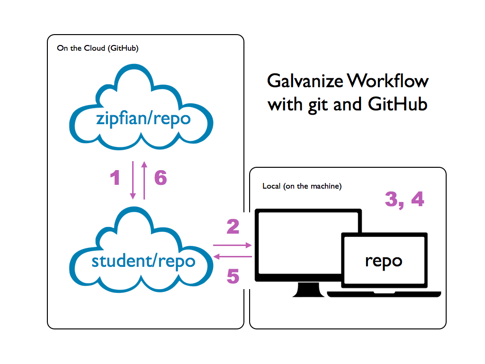

# Assignment: Version Control with git

## Objectives

If you remember one thing and one thing only about version control it should be this: **always be committing**. You can take the Codecademy course linked in the Resources below if you do not feel comfortable using git.

- Objective 1: learn basic git workflow

- Objective 2: learn Galvanize workflow with git and GitHub

_______________________________________

## Questions & Answers

### Objective 1: learn the basic git workflow
We are going to stay on the local machine.

*Step 1:* Getting started.
Let's install git, thanks to the [downloads page](https://git-scm.com/downloads). You will need to configure a few settings to set your username and email. You should only need to do this once.

```
$ git config --global user.name "John Doe"
$ git config --global user.email johndoe@example.com
```

Follow these instructions and answer the corresponding questions:

*Step 2:* creating a new local git repository
- First create a new directory, open it and run the command `git status` in the terminal window. You will have an error message, paste it as your answer.

YOUR ANSWER: ______________

- Let us transform this directory into a git repository by using `git init`. Run the `git status` once more.

YOUR ANSWER: ______________

*Step 3:* Tracking files
- Create filename1.py (text: filename1 version 1) and a filename2.py (text: filename2 version 1)from the terminal with your favorite text editor. Check the status of the git repository and paste it in below.

YOUR ANSWER: ______________

- We are not tracking the files (and therefore recording the changes made). To track a file, the first step is to use the command `git add filename1.py`. This will bring the file to a staging area to get it ready for the next steps. Add filename1.py and then check the status of the git repository.

YOUR ANSWER: ______________

- Now that we have prepared filename1.py, let's record the file through the `git commit -m 'some meaningful commit message'` with your own meaningful message. Again, check the status of the git repository.

YOUR ANSWER: ______________

*Step 4:* Putting git to the test.
- Go back to filename1.py and change the text in the file (text: filename1 version 2). Save it and go back to the terminal. Check the status of the git repository.

YOUR ANSWER: ______________

Git is showing you that the file we were tracking has been modified. Add the new version of filename1.py to the staging area and then commit the changes. Check the status of your repository. Type in the necessary commands.

YOUR ANSWER: ______________

*Step 5:* Navigating commits
- Looking at the log of commits, the 2 commits we have done in the previous steps. The structure of the log is as follows
```
commit commit_tracking_id2
Author: username <user email>
Date:   xxxxxxx

    commit message n°2

commit commit_tracking_id1
Author: username <user email>
Date:   xxxxx

    commit message n°1
```

- To rollback to a previous version, you can use the command `git reset commit_tracking_id1`. Check your filename1.py file, the content have reverted to the first version.
Be careful, this will go back in history and delete access to other newer commits.

- an alternate solution, that might require you to feel more confident with `branch` manipulation (see Going further section at the end of the document), will allow you to temporarily switch to a different commit: `git checkout -b old-state commit_tracking_id`.

*Step 6:* Create README.md file, track it, commit it. Change the README file and commit those new changes. Type in the corresponding commands.

YOUR ANSWER: ______________

### Objective 2: learn Galvanize workflow with git and GitHub
We will copy a Zipfian repository on GitHub, bring it to our local machine, make some changes and commit them on our local machine and then on our GitHub repository.

#### Actions on GitHub, ie in the cloud
1. On Chrome, go to the repository [Zipfian/precourse](https://github.com/zipfian/precourse).
2. Fork the repository, this creates your own version of the repository: student_username/precourse

#### Actions on local machine
1. Clone the repo student_username/precourse to have a local version on your computer.
```
$ git clone https_key_from_github
```
2. Enter the directory and check the status of the git repository

3. Write a filename1.md with your name and why you are excited about the program. Track that file and check on the log that you can see that commit.

YOUR ANSWER (commands for action items 2 and 3): ________________

### Actions on the Cloud
1. Look at your GitHub repository, reload the browser page, nothing changed. To bring the changes to your repository student_username/precourse, use the command `git push`. Look at your GitHub repository, the filename1.md has been added. If you check the zipfian/precourse, changes have not been propagated to this repository.

2. In the Galvanize workflow, once you are done making changes to a repository, you should create a `pull` request to let the Instructors and DSRs know about your progress.

YOUR ANSWER: Understand the following diagram of the workflow by placing various action items in the right place (add, clone, commit, fork, pull, push)



    - 1. _________
    - 2. _________ (corresponding command line: _________)
    - 3. _________ (corresponding command line: _________)
    - 4. _________ (corresponding command line: _________)
    - 5. _________
    - 6. _________

_______________________________________

## Extra resources

- Here's a [visual cheatsheet][git-cheat] that covers key concepts and more.
- Codecademy has a free course that allows you to explore git commands https://www.codecademy.com/learn/learn-git

[git-cheat]: http://ndpsoftware.com/git-cheatsheet.html#loc=workspace

Extra Credit: Going further and using git/GitHub to i) retrieve previous versions fluently or ii) collaborate with others.

- Quick succession of commands to create a branch, switch between branches and finally delete that branch. You could chose to merge it.

  1. create a new branch : `git branch NEW_BRANCH`
  2. go to that branch : `git checkout NEW_BRANCH`
  3. switch back to master : `git checkout master`
  4. delete branch : `git branch -d NEW_BRANCH`
  4. ' compare branches : `git diff <source_branch> <target_branch>``
  4. ''merge branch : `git merge NEW_BRANCH`
